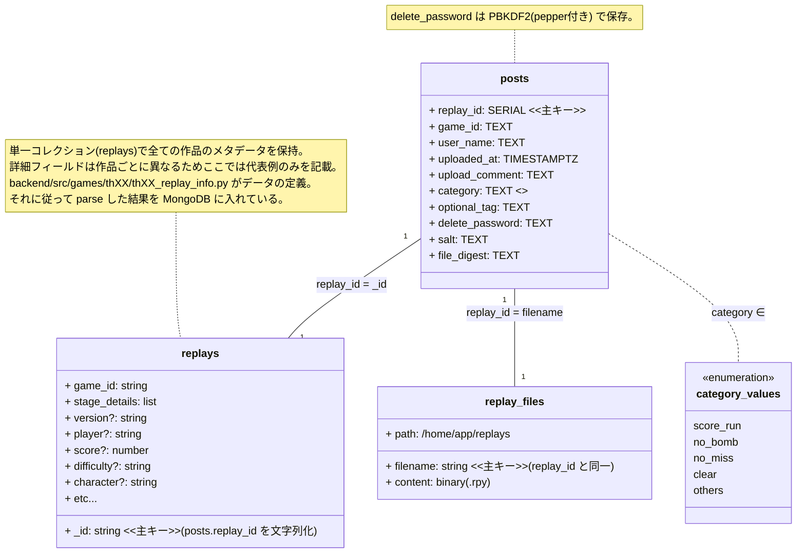

```mermaid
classDiagram

  class posts {
    + replay_id: SERIAL <<主キー>>
    + game_id: TEXT
    + user_name: TEXT
    + uploaded_at: TIMESTAMPTZ
    + upload_comment: TEXT
    + category: TEXT <<enum>>
    + optional_tag: TEXT
    + delete_password: TEXT
    + salt: TEXT
    + file_digest: TEXT
  }
  note for posts "delete_password は PBKDF2(pepper付き) で保存。"

  class category_values {
    <<enumeration>>
    score_run
    no_bomb
    no_miss
    clear
    others
  }

  class replays {
    + _id: string <<主キー>> (posts.replay_id を文字列化)
    + game_id: string
    + stage_details: list<StageDetail>
    + version?: string
    + player?: string
    + score?: number
    + difficulty?: string
    + character?: string
    + etc...
  }
  note for replays "単一コレクション(replays)で全ての作品のメタデータを保持。
  詳細フィールドは作品ごとに異なるためここでは代表例のみを記載。
  backend/src/games/thXX/thXX_replay_info.py がデータの定義。
  それに従って parse した結果を MongoDB に入れている。"

  class replay_files {
    + path: /home/app/replays
    + filename: string <<主キー>> (replay_id と同一)
    + content: binary (.rpy)
  }

  %% Cross-store リレーション（すべて1:1）
  posts "1" -- "1" replays : replay_id = _id
  posts "1" -- "1" replay_files : replay_id = filename
  posts .. category_values : category ∈
```
